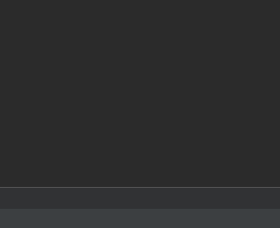
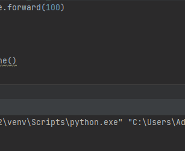
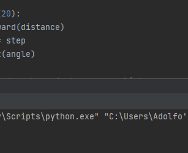
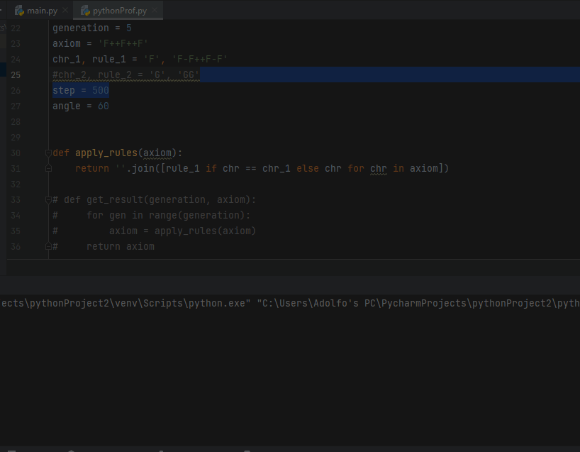
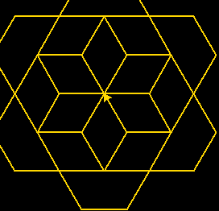
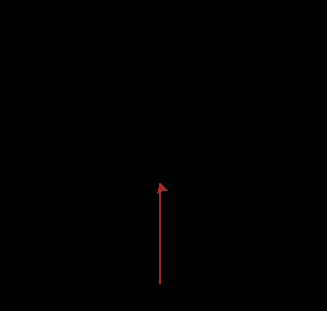

# Fractal
Desenhos Fractais realizados utilizando Turtle

## Recursos utilizados
Para realizar estes desenhos com forma Fractal foi utilizado o Pycharm com a biblioteca Turtle.

## 1-Triangulo

Foi utilizado o seguinte codigo

```javascript
import turtle

turtle.pensize(5)
turtle.left(60)
turtle.forward(200)
turtle.right(120)
turtle.forward(200)
turtle.right(120)
turtle.forward(200)

turtle.done()

```

### Resultado

<!--triagulo-->
<p>
  
</p>


## 2-Estrela
Foi utilizado o seguinte codigo

```javascript
import turtle

for i in range(5):
     turtle.left(144)
     turtle.forward(100)
turtle.done()

```

### Resultado

<!--estrela-->
<p>
  
</p>


## 3-Espiral Quadrada
Foi utilizado o seguinte codigo

```javascript
import turtle

#Expessura da linha
turtle.pensize(5)

#Desenha um Quadrado em espiral
step = 10
angle = 90
distance = 0
for i in range(20):
    turtle.forward(distance)
    distance += step
    turtle.left(angle)

#Abre a tela do desenho e fecha com um click
turtle.Screen().exitonclick()

```

### Resultado

<!--espiral-->
<p>
  
</p>


## 4-Fractal Floco de Neve
Foi utilizado o seguinte codigo

```javascript
import time
import turtle

//configurações da tela
#Config. screen
WIDTH, HEIGHT = 1200, 768//definição de resolução da tela
screen = turtle.Screen()//chama a função screen da biblioteca Turtle
screen.setup(WIDTH, HEIGHT)
#screen.screensize(2*WIDTH, 2*HEIGHT)//tamanho da tela
screen.bgcolor('black') //determinação da cor de fundo
screen.delay(0)//tempo de espera


//Configuração do turtle
#Config. Turtle
trig = turtle.Turtle()
trig.pensize(2)//Expessura da linha
trig.speed(3)//velociade de realização do traço
trig.setpos(-WIDTH // 6, HEIGHT // 6)
trig.color('gold')//cor do traço

//Definição das coordenadas de geração do fractal

# L-system
generation = 5
axiom = 'F++F++F'
chr_1, rule_1 = 'F', 'F-F++F-F'
#chr_2, rule_2 = 'G', 'GG'
step = 600
angle = 60


def apply_rules(axiom):
    return ''.join([rule_1 if chr == chr_1 else chr for chr in axiom])

# def get_result(generation, axiom):
#     for gen in range(generation):
#         axiom = apply_rules(axiom)
#     return axiom

//Definição da palavra Geração
for gen in range(generation):
    turtle.pencolor('white')
    turtle.goto(-WIDTH // 2 + 60, HEIGHT // 2 - 100)
    turtle.clear()
    turtle.write(f'Geração: {generation}', font=('Arial', 60, "normal"))

    trig.setheading(0)
    trig.goto(-WIDTH // 6, HEIGHT // 6)
    trig.clear()

    length = step / pow(3, gen)

    for chr in axiom:
        if chr == chr_1:
            trig.forward(length)
        elif chr == '+':
            trig.right(angle)
        elif chr == '-':
            trig.left(angle)

    axiom = apply_rules(axiom)

screen.exitonclick()

```

### Resultado

<!--fractal-->
<p>
  
</p>


## 5-Fractal Triângulos
Foi utilizado o seguinte codigo

```javascript
import time
import turtle

//configurações da tela
#Config. screen
WIDTH, HEIGHT = 1200, 768//definição de resolução da tela
screen = turtle.Screen()//chama a função screen da biblioteca Turtle
screen.setup(WIDTH, HEIGHT)
#screen.screensize(2*WIDTH, 2*HEIGHT)//tamanho da tela
screen.bgcolor('black') //determinação da cor de fundo
screen.delay(0)//tempo de espera


//Configuração do turtle
#Config. Turtle
trig = turtle.Turtle()
trig.pensize(2)//Expessura da linha
trig.speed(3)//velociade de realização do traço
trig.setpos(-WIDTH // 6, HEIGHT // 6)
trig.color('gold')//cor do traço

//Definição das coordenadas de geração do fractal
# L-system
generation = 5
axiom = 'F+F+F-'
chr_1, rule_1 = 'F', 'F+F+F-'
#chr_2, rule_2 = 'G', 'GG'
step = 1500
angle = 60

def apply_rules(axiom):
    return ''.join([rule_1 if chr == chr_1 else chr for chr in axiom])

# def get_result(generation, axiom):
#     for gen in range(generation):
#         axiom = apply_rules(axiom)
#     return axiom

//Definição da palavra Geração
for gen in range(generation):
    turtle.pencolor('white')
    turtle.goto(-WIDTH // 2 + 60, HEIGHT // 2 - 100)
    turtle.clear()
    turtle.write(f'Geração: {generation}', font=('Arial', 30, "normal"))

    trig.setheading(0)
    trig.goto(-WIDTH // 6, HEIGHT // 6+60)
    trig.clear()

    length = step / pow(3, gen)

    for chr in axiom:
        if chr == chr_1:
            trig.forward(length)
        elif chr == '+':
            trig.right(angle)
        elif chr == '-':
            trig.left(angle)

    axiom = apply_rules(axiom)

screen.exitonclick()

```

### Resultado

<!--fractal2-->
<p>
  
</p>


## 5-Fractal Árvore
Foi utilizado o seguinte codigo

```javascript
import turtle

turtle.bgcolor('black') //Define a cor de fundo

def arvore(t, comprimento, nivel, cores):
    if nivel == 0:
        return
    cor = cores[nivel % len(cores)] // seleciona uma cor da paleta baseada no nível atual
    t.color(cor)
    t.pensize(nivel/3) // aumenta o tamanho da caneta com base no nível atual
    t.forward(comprimento)
    t.left(45)
    arvore(t, 0.6*comprimento, nivel-1, cores)
    t.right(90)
    arvore(t, 0.6*comprimento, nivel-1, cores)
    t.left(45)
    t.backward(comprimento)

t = turtle.Turtle()
t.left(90)
cores = ['brown', 'green', 'red'] // paleta de cores utilizadas
arvore(t, 100, 6, cores)
turtle.done() //Termina a geração, pausando a linha

```

### Resultado

<!--arvore-->
<p>
  
</p>